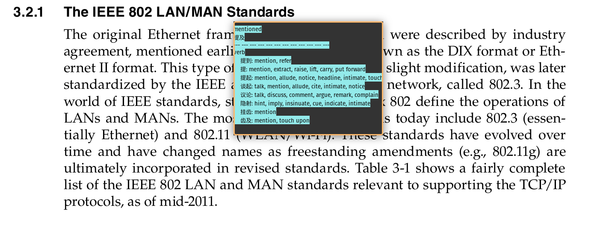
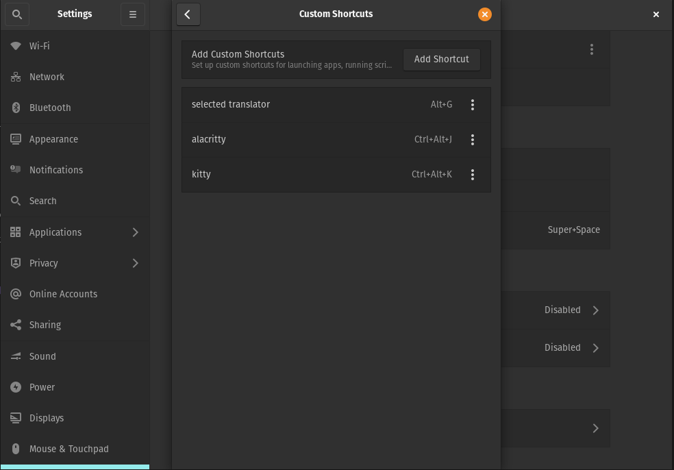

# Selected translator (MIT LICENSE)

This is a translator based on google translate api on Linux systems. It is able to translate the words selected in other desktop applications.

On popos (gnome)




## Dependencies

* Python3
* pydub (python3 package)
* ffmpeg
* tk or gtk or notify-send
* xclip


## Installation

```bash
sudo cp selected_translator.py /usr/local/bin/selected_translator
sudo chmod +x /usr/local/bin/selected_translator
```


## Usage

`selected_translator` can be used in terminal or used with system shortcuts. The appriciated usage is combined with system shortcuts. Select the words, type the shurtcut.

The shortcut setting is according to your WM. For example,

On popos (gnome)


